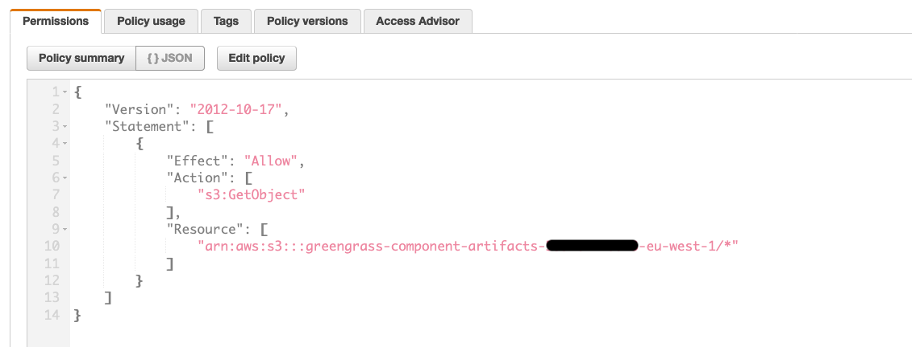

# Using AWS IoT Greengrass to provision and manage your LoRaWAN gateways at scale

**This implementation is for demonstration purposes only.**

With [AWS IoT Core for LoRaWAN](https://docs.aws.amazon.com/iot/latest/developerguide/connect-iot-lorawan.html), customers can now setup a fully managed LoRaWAN network by connecting their own LoRaWAN devices and gateways to AWS IoT Core - without developing or operating a LoRaWAN Network Server (LNS).
This repository contains an example AWS IoT Greengrass component to provision and manage your LoRaWAN gateways at scale. 

[AWS IoT Greengrass components](https://docs.aws.amazon.com/greengrass/v2/developerguide/manage-components.html) are software modules that you deploy to Greengrass core devices. Components can represent applications, runtime installers, libraries, or any code that you would run on a device. 

Once deployed to your LoRaWAN Gateway or groups of LoRaWAN gateways, the component will provision the gateway to AWS IoT Core for LoRaWAN, generate and store all the certificates needed to securely connect to the Configuration and Update Server (CUPS) and the LNS server. 

Finally, the component will launch [Basics Station](https://github.com/lorabasics/basicstation) to connect the gateway to AWS IoT Core for LoRaWAN. 

This component has been developed for Raspberry Pi based gateways and tested with the [RAK7246](https://store.rakwireless.com/products/rak7246-lpwan-developer-gateway?variant=36313275334814) and the [RAK7248](https://store.rakwireless.com/products/rak7248?variant=40528977756358)

<br>

## Solution architecture 

<br>


<br>

## Prerequisites

* A Greengrass Version 2 compatible LoRaWAN Gateway. This component has been developed for Raspberry Pi based gateways and tested with the [RAK7246](https://store.rakwireless.com/products/rak7246-lpwan-developer-gateway?variant=36313275334814) and the [RAK7248](https://store.rakwireless.com/products/rak7248?variant=40528977756358)

* To deploy this component, you first need to install [AWS IoT Greengrass on your LoRaWAN gateway(s)](https://docs.aws.amazon.com/greengrass/v2/developerguide/getting-started.html). 

* Python 3.7 or later installed on your development computer.

* [AWS Command Line Interface (AWS CLI)](https://docs.aws.amazon.com/cli/latest/userguide/cli-chap-install.html) installed and configured with credentials on your development computer. 

* A [Basics Station executable](https://github.com/lorabasics/basicstation) named ```station``` compiled for your target platform (your LoRaWAN gateways)

* Create the [```IoTWirelessGatewayCertManagerRole```](https://docs.aws.amazon.com/iot/latest/developerguide/connect-iot-lorawan-rfregion-permissions.html#connect-iot-lorawan-onboard-permissions) to allow the Configuration and Update Server (CUPS) to manage gateway credentials. **Make sure you perform this procedure before deploying the component**; however, you need to do this only once. This procedure is explained in the video [Getting Started with AWS IoT Core for LoRaWAN](https://www.youtube.com/watch?v=6-ZrdRjqdTk)

## Getting Started
<br> 

**This implementation is for demonstration purposes only.**

<br> 

### 1. Create the artifact for the component 

<br> 

Every Greengrass component is composed of a recipe and artifacts. Artifacts can include scripts, compiled code, static resources, and any other files that a component consumes.

To deploy the component, you need to provide an artifact as an archive file named ```ggbasics.zip``` which includes: 

- The ```station.conf``` configuration file. Basics Station requires a configuration file named ```station.conf```, which contains settings for the configuration of the LoRaWAN gateway itself and the configuration of the radio concentrator boards. If you dont' use the one provided in the folder ```artifacts```, make sure to add the field ```"routerid": ""``` in the ```"station_conf"```section of your ```station.conf``` file.  

- A [Basics Station executable](https://github.com/lorabasics/basicstation) named ```station``` compiled for your target platform (your LoRaWAN gateways). 

- The python script named ```main.py``` provided in the ```artifacts``` folder. This scripts will provision the LoRaWAN gateway to AWS IoT Core for LoRaWAN. 

- The ```reset_gw.sh```script that will reset the LoRa concentrator before running Basics Station. This is done to prevent the LoRa concentrator to stay in an Error state. You need to check if the GPIO Pins used in the script suit your Gateway. 

- A folder ```dependencies``` in which [the AWS SDK for Python (Boto3)](https://boto3.readthedocs.io/) is installed. 


Add the [Basics Station executable](https://github.com/lorabasics/basicstation) named ```station``` compiled for your target platform in the ```artifact``` folder and then compress the **content** of the artifact folder in an archive named ```ggbasics.zip```.

***Make sure to compress the content of the folder and not the folder itself.***

<br>


<br>

**Before proceeding, you must have a ```ggbasics.zip``` archive that contains the following folder and files:** 

```bash
|___station.conf # Configuration file
|___station # Basics Station executable  
|___main.py # Python script to provision the gateway in AWS IoT Core for LoRaWAN
|___reset_gw.sh # Shell script to reset the LoRa concentrator 
|___dependencies # folder with the AWS SDK for Python (Boto3) installed
    |___boto3
    |___*
```

### 2. Create an S3 bucket to host your AWS IoT Greengrass component artifacts

<br>

Now that you have your artifact ready, you need to create an Amazon S3 bucket (if you don't have one already) to host your AWS IoT Greengrass component artifacts. 

Run the following command to create a bucket with your AWS account ID and AWS Region to use a unique bucket name. 

Replace ```123456789012``` with your AWS account ID and ```awsregion```  with the AWS Region that you use to provision your gateways. 

*Make sure that AWS IoT Core for LoRaWAN is available in the region you choose.*

<br>

```shell 
aws s3 mb s3://greengrass-component-artifacts-123456789012-awsregion
``` 

The command outputs the following information if the request succeeds.

```
make_bucket: greengrass-component-artifacts-123456789012-awsregion
```

<br>

### 3. Upload the artifact in your S3 bucket

<br>

upload the artifact ```ggbasics.zip ``` to the Amazon S3 bucket you created in the folder artifacts with the following command. 

```shell 
aws s3 cp ggbasics.zip s3://REPLACE_WITH_YOUR_S3_BUCKET/artifacts/
```

The command outputs a line that starts with upload: if the request succeeds. 

<br> 

### 4. Allow the core device to access component artifacts

<br>

[Allow](https://docs.aws.amazon.com/greengrass/v2/developerguide/getting-started.html#upload-first-component) the Greengrass core device to access component artifacts in this Amazon S3 bucket. 

Each core device has a core device [IAM role](https://docs.aws.amazon.com/greengrass/v2/developerguide/device-service-role.html) that allows it to interact with AWS IoT and send logs to the AWS Cloud. 

You can find this role in the AWS IoT Console, **Secure**, **Role Aliases**. 

<br>


<br>

This device role doesn't allow access to Amazon S3 buckets by default, so you must create and attach a policy that allows the core device to retrieve component artifacts from the S3 bucket.

<br>



<br>

```json
{
  "Version": "2012-10-17",
  "Statement": [
    {
      "Effect": "Allow",
      "Action": [
        "s3:GetObject"
      ],
      "Resource": "arn:aws:s3:::greengrass-component-artifacts-123456789012-awsregion/*"
    }
  ]
}
```

<br>

__Then you need to create another policy that authorizes the component to perform the action in IoT and IoTWireless and attach it to the same role__. 

Your policy needs the following authorizations. 

<br> 

```json
{
    "Version": "2012-10-17",
    "Statement": [
        {
            "Sid": "LorawanGGv2ComponentProvisioning",
            "Effect": "Allow",
            "Action": [
                "iot:CreateKeysAndCertificate",
                "iotwireless:GetWirelessGateway",
                "iotwireless:AssociateWirelessGatewayWithCertificate",
                "iotwireless:GetServiceEndpoint",
                "iotwireless:CreateWirelessGateway"
            ],
            "Resource": "*"
        }
    ]
}
```

### 5. Create a component resource in AWS IoT Greengrass 

<br>

Replace in the recipe ```recipe.yaml``` the artifact URI with the artifact's Amazon S3 URI. 

Your script artifact's Amazon S3 URI is the URI that you upload the artifact to in the previous step. This URI should look similar to the following example: 

```
s3://greengrass-component-artifacts-123456789012-awsregion/artifacts/ggbasics.zip
```
The Amazon S3 URI is composed of the bucket name and the path to the artifact object in the bucket. 

<br>


<br>

**Configure the LoRa region for your gateways** in the ```LoraRegion``` parameter.

<br>


<br>

Create a component resource in AWS IoT Greengrass from the recipe ```recipe.yaml```. 

<br>

Run the following command to create the component from the recipe, which you provide as a binary file. 

```
aws greengrassv2 create-component-version --inline-recipe fileb://recipe.yaml
```

The response looks similar to the following example if the request succeeds.

```json
{
    "arn": "arn:aws:greengrass:eu-west-1:123456789012:components:abenfat.lorawan.ggbasics:versions:1.0.0",
    "componentName": "abenfat.lorawan.ggbasics",
    "componentVersion": "1.0.0",
    "creationTimestamp": "2021-07-23T17:04:15.504000+02:00",
    "status": {
        "componentState": "REQUESTED",
        "message": "NONE",
        "errors": {}
    }
}

```

The ```abenfat.lorawan.ggbasics``` component is now available in AWS IoT Greengrass and you can [deploy it](https://docs.aws.amazon.com/greengrass/v2/developerguide/manage-deployments.html) to your AWS IoT Greengrass core devices.

<br>

### 6. Deploy the component

<br>

***Before deploying the component, make sure you don't have already your gateway(s) registered to AWS IoT Core for LoRaWAN***

<br>

With AWS IoT Greengrass, you can deploy components to individual devices or groups of devices. You specify which components to deploy and the configuration update to deploy for each component.

In the navigation pane of the [AWS IoT console](https://console.aws.amazon.com/iot/), choose **Greengrass**, then choose **Components**.

<br> 

you should see the component in the list **My Components**.

<br> 


<br>

Choose the component, and choose **Deploy**. If there is an existing deployment that targets your group of gateways, you can add the component to the existing deployment, otherwise you can create a new deployment. 

Select the existing deployment and choose **Next**. Then choose **Next again**. In the Select components page, make sure you have selected the components you want to deploy and choose **Next**. 

Then choose **Next** again. 

In the Configure advanced settings, leave the default settings and then choose **Next**.  

Finally, choose **Deploy**. 

<br>


<br>

The deployment can take several minutes to complete. You can check in the __Greengrass Core device__ the component logs to check the deployment: 

```
sudo tail -f /greengrass/v2/logs/abenfat.lorawan.ggbasics.log
```

<br>


<br> 

You can check that your gateways have been provisioned! 

<br>


<br> 